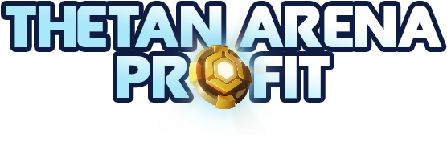

<div align="center">
  

  # Thetan Arena Profit

  Uma plataforma para calcular estimativas de lucros com um Heroi NFT no jogo <a href="https://thetanarena.com/">Thetan Arena</a>.
  <br>

  
  
  
  


  <h2> 🍸 Demo </h2>
  <a href="https://thetan-arena-profit.herokuapp.com/">Live Demo</a>
  <br>
  
</div>

<br>
<h2> 🍸 Build Setup </h2>

```bash
# install dependencies
$ yarn install

# serve with hot reload at localhost:3000
$ yarn dev

# build for production and launch server
$ yarn build
$ yarn start

# generate static project
$ yarn generate
```

<h2> 👨🏾‍💻 Techs </h2>
<li> Nuxt.js </li>
<li> Vuetify.js </li>
<li> Typescript </li>
<br>

<h2> 👤 Author </h2>

<h3> <b> Waliston Belles </b></h3>

<li> Github: <a href="https://github.com/WalistonBelles">@walistonbelles</a> </li>
<li> Linkedin: <a href="https://www.linkedin.com/in/waliston-belles-88927a212/">@walistonbelles</a> </li>
<li> Discord:  Waliston#0145</a></li>
<br>